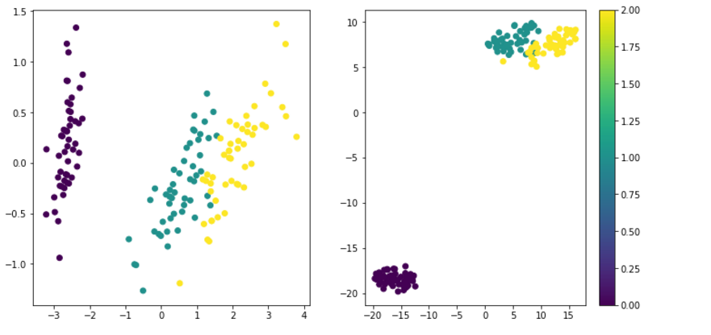
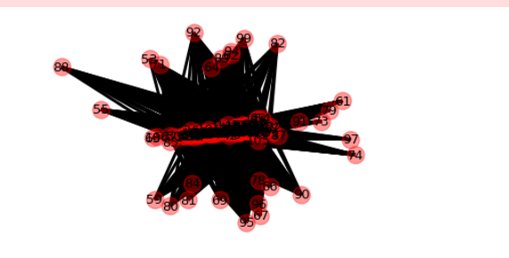
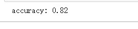

# Clustering Schoolwork

## 1.整体思路

首先我用的是谱聚类基于比例割我的代码分三部分

1.iris数据集的图表示

1.定义函数如求距离函数，高斯相似度函数，相似度矩阵函数，拉普拉斯等等

2.mian函数开始聚类

3.聚类结果图表示

4.正确率的计算

## 2.成果展示

#### 定义函数

```python
import pandas as pd
import numpy as np1
from __future__ import division
import scipy.io as scio
from scipy import sparse
from scipy.sparse.linalg.eigen import arpack
from numpy import *
import matplotlib.pyplot as plt
from sklearn.datasets import load_iris
%matplotlib inline
iris = load_iris()
from numpy import *
import numpy as np
from sklearn.cluster import SpectralClustering
 
#定义高斯相似度
def gaussian_simfunc(v1,v2,sigma=1):
	tee=(np.linalg.norm(v1-v2)**2)/(2*(sigma**2))
	return exp(tee)

#构建相似度矩阵W
def construct_W (vec):
    n = len (vec)
    W = zeros ((n, n))
    for i in range(n):
        if(i % 1000==0):
            print("c--"+str(i))
        for j in range(i,n):
            W[i,j] = W[j,i] = gaussian_simfunc (vec[i], vec[j])   #
   
    return W


def calLaplacianMatrix(adjacentMatrix):#构建喇布拉斯矩阵

   
    degreeMatrix = np.sum(adjacentMatrix, axis=1)#度矩阵

    #  Matrix: L=D-A
    laplacianMatrix = np.diag(degreeMatrix) - adjacentMatrix

    # 标准化度矩阵
    # D^(-1/2) L D^(-1/2)
    sqrtDegreeMatrix = np.diag(1.0 / (degreeMatrix ** (0.5)))
    return np.dot(np.dot(sqrtDegreeMatrix, laplacianMatrix), sqrtDegreeMatrix)
from sklearn.cluster import KMeans

```

#### 聚类主函数

```python
if __name__ == '__main__':
    S=construct_W (iris.data)#计算相似度矩阵并确定阈值
    S[S<0]=0
    S[S<18]=0

   


L=calLaplacianMatrix(S)#计算喇布拉斯的特征向量和值并且使用k聚类
lam, H = np.linalg.eig(L)
model = KMeans(n_clusters=3)
model.fit(H)
result=model.labels_


import matplotlib.pyplot as plt#使用pca 或tsne 降维画出聚类效果图
from sklearn.manifold import TSNE
from sklearn.decomposition import PCA
tsne = TSNE(n_components=2, learning_rate=100).fit_transform(iris.data)
pca = PCA().fit_transform(iris.data)
plt.figure(figsize=(12, 6))
plt.subplot(121)
plt.scatter(pca[:, 0], pca[:, 1], c=iris.target)
plt.subplot(122)
plt.scatter(tsne[:, 0], tsne[:, 1], c=iris.target)
plt.colorbar()
plt.show()

```



#### 图表示

```python
mat= S
mat[mat<0]=0
mat[mat<100]=0
g = nx.Graph()
for i in range(len(mat)):
    for j in range(len(mat)):
        if(mat[i,j]>100):  #删除边的权重小于等于0的边
         g.add_edge(i, j,weight=mat[i,j])

   
      # 按权重划分为重权值得边和轻权值的边
elarge = [(u, v) for (u, v, d) in g.edges(data=True) if d['weight'] > 0.5]
esmall = [(u, v) for (u, v, d) in g.edges(data=True) if d['weight'] <= 0.5]
      # 节点位置
pos = nx.spring_layout(g)  # positions for all nodes
      # 画出节点位置
      # nodes
nx.draw_networkx_nodes(g, pos, node_color='b',node_size=300,alpha=0.4)
      # 根据权重，实线为权值大的边，虚线为权值小的边
nx.draw_networkx_edges(g, pos, edgelist=elarge,
                             width=3)
nx.draw_networkx_edges(g, pos, edgelist=esmall,
                        width=1, alpha=0.5, edge_color='g', style='dashed')

      # labels标签定义
nx.draw_networkx_labels(g, pos, font_size=13, font_family='sans-serif')

plt.axis('off')
plt.show()
```



#### 计算正确率


```python
import numpy as np
import matplotlib.pyplot as plt
 
 
class Performance:#定义一个类
   
    def __init__(self, labels, scores, threshold=0.5):#初始化
    
        self.labels = labels
        self.scores = scores
        self.threshold = threshold
        self.db = self.get_db()
        self.TP, self.FP, self.FN, self.TN = self.get_confusion_matrix()
 
    def accuracy(self):#计算正确率
     
        return (self.TP + self.TN) / (self.TP + self.FN + self.FP + self.TN)
 
    def get_db(self):
        db = []
        for i in range(len(self.labels)):
            db.append([self.labels[i], self.scores[i]])
        db = sorted(db, key=lambda x: x[1], reverse=True)
        return db
 
    def get_confusion_matrix(self):#计算混淆矩阵
        tp, fp, fn, tn = 0., 0., 0., 0.
        for i in range(len(self.labels)):
            if self.labels[i] == 1 and self.scores[i] >= self.threshold:
                tp += 1
            elif self.labels[i] == 0 and self.scores[i] >= self.threshold:
                fp += 1
            elif self.labels[i] == 1 and self.scores[i] < self.threshold:
                fn += 1
            else:
                tn += 1
        return [tp, fp, fn, tn]

if __name__ == '__main__':
    labels = model.labels_
    scores = iris.target
    p = Performance(labels, scores)
    acc = p.accuracy()
    print('accuracy: %.2f' % acc)


```



## 3.细节描述

对相似度的度量用的是高斯相似度

构建完拉普拉斯矩阵后进行了标准化	

计算相似度确定阈值为2.48347708e+04

画聚类效果图时用了pca 和tsne两种降维方式

画iris的图时用了虚实两种线

计算正确率用的是混淆矩阵算正确率

正确率达到0.82感觉是因为阈值确定较好，经测试发现阈值对聚类效果的影响很大。最主要的是刚开始邻接矩阵的确定，判断和处理。剩下的步骤都是较统一的。

### 4.问题

画聚类图效果较差数据太多，成团了不会详细调成那种透明的

## 张冲 2016011331